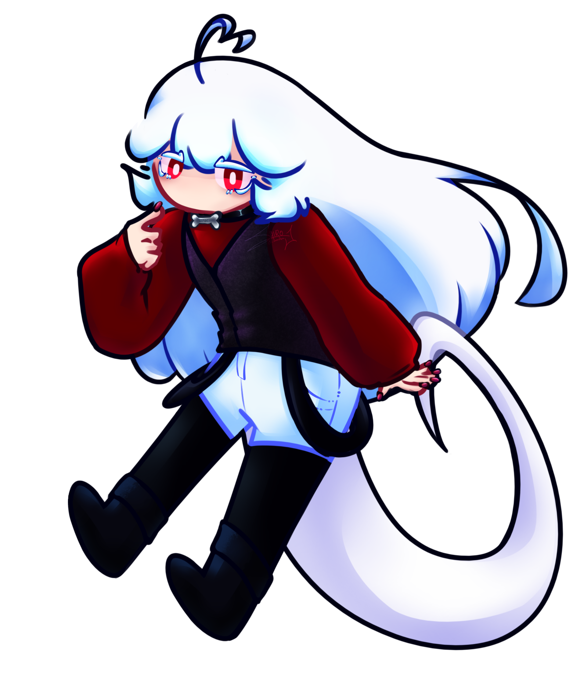
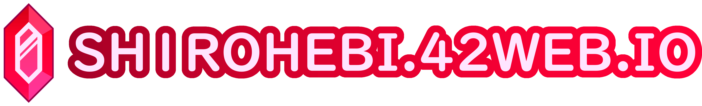

<div align="center">

<h1>✦ Sh1rohebi Website ✦</h1>

</div>



<p>
A personal portfolio and commission website focused on art,
character work, and custom web design.
</p>

<p>
<a href="https://sh1rohebi.42web.io">

</a>
</p>

<br>

<div style="padding-top: 80px;">

<h2>✦ Features ✦</h2>

<ul>
<li>Responsive design for desktop and mobile</li>
<li>Smooth scrolling navigation</li>
<li>Custom FAQ system</li>
<li>Commission information & Terms of Service</li>
<li>Reusable page components</li>
<li>Animated hover effects</li>
<li>Cyber-inspired UI styling</li>
<li>Open source structure for learning/customization</li>
</ul>

</div>

<br clear="right">

<hr>

<h2>✦ Built With ✦</h2>

<ul>
<li>HTML5</li>
<li>CSS3</li>
<li>JavaScript</li>
<li>Krita (graphics/artwork)</li>
</ul>

<p>Hosted using InfinityFree.</p>

<hr>

<h2>✦ Website Structure ✦</h2>

```text
root/
│
├── index.html
├── faq.html
├── commissions.html
├── tos.html
│
├── css/
│   ├── mainstyle.css
│   └── unfinishedPage.css
│
├── js/
│   └── includes.js
│
├── components/
│   ├── footer.html
│   └── header.html
│
└── img/
````

<hr>

<h2>✦ Customization ✦</h2>

<p>You are free to:</p>

<ul>
<li>Modify the styling</li>
<li>Reuse components</li>
<li>Learn from the code</li>
<li>Adapt the layout for your own website</li>
</ul>

<p>
Please do not repost my artwork or impersonate me using this project.
</p>

<hr>

<h2>✦ License ✦</h2>

<p>
This project is open source for educational and personal inspiration purposes.
</p>

<p>
Code may be reused with credit.
</p>

<p>
Artwork and original characters are not free to use unless explicitly stated otherwise.
</p>

<hr>

<div align="center">

<a href="https://sh1rohebi.42web.io">
    
</a>

</div>
